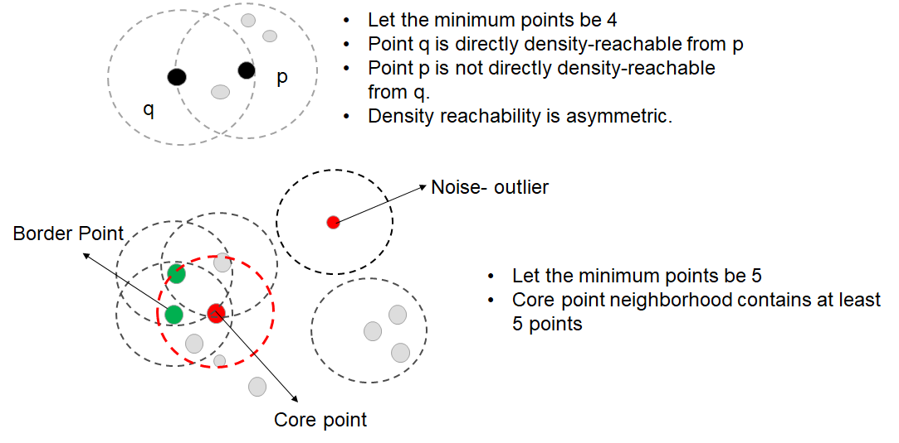
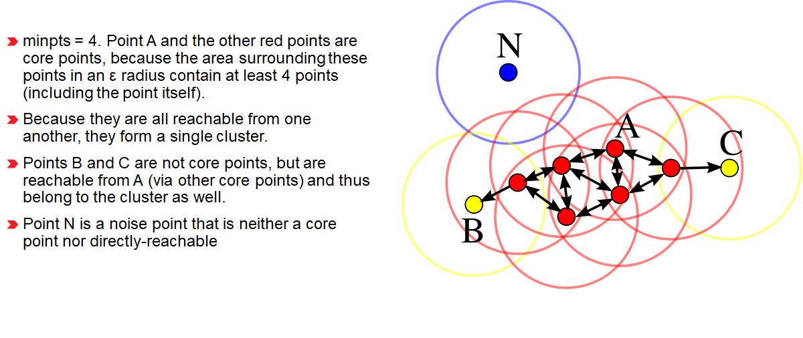
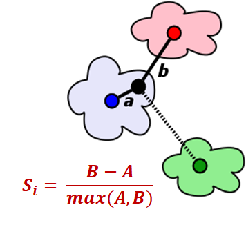

# Density Based Spatial Clustering of Applications

Designed to discover clusters of arbitrary shape. 

k means clustering assumes spherical shapes of clusters and does not work well when the clusters are in different shapes. 

Main components of DBSCAN algorithm are the concept of core samples, border samples, noise, epsilon and minimum samples. 

The algorithm has only two parameters namely epsilon and minimum samples. 

---

## Terminologies

epsilon neighborhood- The epsilon neighborhood of a point p, denoted by $N_{eps}(p)$, is defined by

 $N_{eps} (p)={q∈D|dist(p,q)≤eps}$ 

Core point - a point p is a core point if at least minimum points are within the distance epsilon of it(including p) 

Border point - p is border point if it does not have at least minimum points neighbors within the epsilon distance of itself, but is a neighbor of a core point. 

Noise- p is a noise point if it does not have at least minimum points neighbors within epsilon distance of itself, and is not a neighbor of a core point. 

Directly density reachable- a point q is directly density reachable from object p if p is a core point and q is in the epsilon neighborhood of p - Asymmetric relationship. 

Density reachable - q is density reachable from p if there are a chain of points that  are directly density reachable from p to q. 

Cluster - choose core point q, a cluster c contains all points density reachable by q. 

if p is a core point, then it forms a cluster together with all points that are reachable from it. Each cluster contains at least one core point, non-core points can be a part of a cluster, but they form its edge, since they cannot be used to reach more points. 

Reachability is not symmetric relation- by definition, only core points can reach non-core points. The opposite is not true, so a non-core point may be reachable, but nothing can be reached from it. 

Therefore a further notion of connectedness is needed to formally define the extent of the clusters found by DBSCAN. 

Two points p and q are density-connected if there is a point o such that both p and q are reachable from o. - Density connectedness is symmetric.

A cluster then satisfies two properties

- Points within the cluster are mutually density connected.
- If a point is density-reachable from some point of the cluster, it is part of the cluster as well.

    

---

## Algorithm

- minimum points and epsilon are initialized.
- a starting point is selected at random at it’s neighborhood area is determined using radius epsilon.
- if there are at least minimum number of points in the neighborhood, the point is marked as core point, and cluster formation starts.
- Otherwise the point is marked as noise.
- Once a cluster formation starts(let’s say cluster A), all the points within the neighborhood of initial point become a part of cluster A.
- If these new points are also core points, the points that are in the neighborhood of them are also added to cluster A.
- Next step is to randomly choose another point among the points that have not been visited in the previous steps. Then same procedure applies.
- This process is finished when all the points are visited.

To find the optimal value, we plot k-distance graph, which represents how far away the kth nearest neighbor from the every single point in our dataset.

---

## Evaluation using Silhouette Coefficient

- Silhouette coefficient or silhouette score is a metric used to calculate the goodness of a cluster. Its value ranges from -1 to 1.
- Cohesion- How closely the cluster points are together- intra cluster
- Separation - Well defined groups need to be different- or separate from other groups- inter cluster.
- For each point p, first find the average distance between p and all other points in the same cluster  - this is a measure of cohesion, call it A.
- Then find the average distance between p and all points in the nearest cluster - this is a measure of separation from the closest other cluster, call it B.
- The silhouette coefficient for p is defined as the difference between B and A divided by greater of the two {A,B}.
- B should be large and A should be small - What we required.

    

---

## Advantage/Disadvantages

- finding the number of clusters automatically
- Helps to find the outliers.
- Clusters need not be in a specific shape- all it cares about is the density reachability.
- Very sensitive to hyperparameters epsilon and minimum samples.
- Can be less effective in high dimensional data.