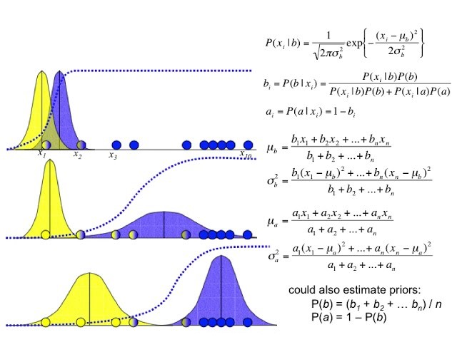

# Gaussian Mixture Models-Expectation Maximisation Algorithm

Finding a maximum likelihood solution typically requires taking the derivatives of the likelihood function with respect to all the unknown values, the parameters and the latent variables, and simultaneously solving the resulting equation.

We don’t know two pieces of information simultaneously.

For example, a mixture model can be described more simply by assuming that each observed data point has a corresponding unobserved data point, or latent variable, specifying the mixture component to which each data point belongs.

Mixture models are probabilistic models for representing the presence of subpopulations within an overall population. 

Identifying which sub-population to which each individual observation belongs to.

One can simply pick arbitrary values for one of two sets of unknowns, use them to estimate the second set.

Use these new values to find a better estimate of the first set, and then keep alternating between the two until the resulting values both converge to fixed points. 

Two actual steps - Expectation and Maximization.

The EM alternates between performing the E step, which creates a function of expectation of log-likelihood evaluated using the current estimate for the parameters. 

M- step computes parameters which maximizes the expected log-likelihood found on the E step.

These parameter estimates are then used to determine the distribution of the latent variables in the next E -step. 

---

## Gaussian Mixture Models

- data from two gaussians
- we don’t know the parameters
- we don’t know which data point comes from which gaussian.
- If we know at least one of them we can estimate the second.
- EM algorithm provides solution.
- Initialize the parameter values.
- Find the weights.
- Weight -given a data point what is the probability that it came from a particular distribution.
- Weight is actually representing the coloring of data points.
- Update the parameters.
- Iterate the steps until convergence.

## Illustration in one-dimensional case

