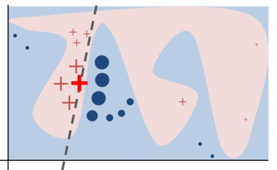
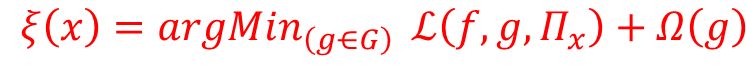
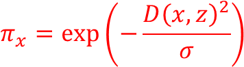
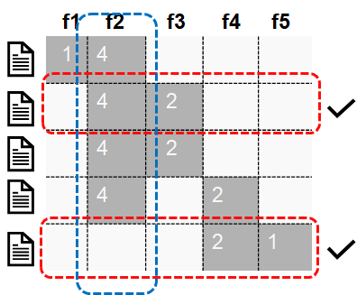

# Local Interpretable Model Agnostic Explanation

Can we trust prediction? Lime explanation algorithm 

Can we trust model? Submodular pick algorithm 

Explains predictions in an interpretable and faithful manner, by learning a surrogate model locally around the prediction. 

What is an interpretable representation? binary vector indicating presence and absence of words, super-pixels.

---

## Lime algorithm

- start with an instance of interest
- get the interpretable representation.
- creating perturbed data samples.
- get the predictions of the perturbed samples from complex model.
- we have the training data and targets.
- we give weights to each instance in the new training set.
- find the distance between each perturbed instances with the input instance
- convert distance to similarity score using squared exponential kernel.
- fit the weighted local linear model.
- Get the explanations in terms of top k features

We use weighted squared loss function for minimization. 

Sigma is the kernel width. Larger sigma implies that the points which are far away also considered as similar. 

---

## Sub-Modular pick Algorithm

- To understand the entire model, one must review the explanations for many of the diverse predictions.
- Due to difficulty of selecting the most informative examples, a method called submodular pick algorithm has been suggested.
- we run the explanation explanation model on available data set. - get the explanation matrix.
- Compute the global importance of individual features be aggregation.
- We define a coverage function for an instance, which gives an aggregated measure of all the features in the explanation.
- We pick the first instance which has the highest coverage value.
- Iteratively add the instances with the highest maximum coverage gain to representive non-redundant explanation set.

---

## Advantages/Disadvantages

- model agnostic explanation
- works with multiple data formats.
- provides selective explanations.
- Helps in model debugging.
- Understanding why a customer got rejected from an offer.
- Unrealistic data samples.
- Kernel width and complexity of the surrogate models should be carefully taken.
- if the decision boundary is too non-linear, it can not be sufficiently approximated by a linear model.
- interpretable representation will not be powerful enough to explain certain behaviors.