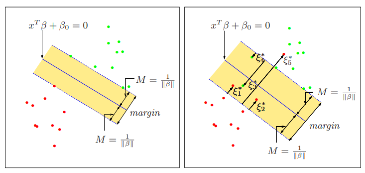

# Support Vector Machines 

$\text{Datatset = }(x_1, y_1),(x_2,y_2),...(x_N,y_N)$; 

$x_i\in \R^p$ ,  $y_i\in \{-1,1\}.$ 

$\text{Hyperplane: } x^T\beta +\beta_0 = 0$ , where $||\beta||=1.$  

$\text{Classification Rule: }G(x) = sign[x^T\beta +\beta_0]$

$\text{Optimization Problem : }\max\limits_{{\beta,\beta_0, ||\beta_0||=1}} M \ni y_i(x_i^T\beta + \beta_0 ) \geq M ,  i = 1,..., N$  

$\text{Margin: }M = \frac{1}{||\beta||}$  

The optimization problem can be conveniently rephrased as follows; 

$\min\limits_{{\beta,\beta_0}} ||\beta|| \ni y_i(x_i^T\beta + \beta_0 ) \geq 1 ,  i = 1,..., N$

---

Suppose now that the classes overlap in feature space(second figure)  → Allowing some points to be on the wrong side of the margin → still we need to maximize M.

$\text{Modification of Optimization:       }y_i (x_i^T\beta +\beta_0)\geq M(1-\xi)$

---

$\xi _i$  in the constraint $y_i(x_i ^T\beta +\beta_0)\geq M(1-\xi_i)$  is the proportional amount by which the prediction $f(x_i) = x_i ^T\beta + \beta_0$  is on the wrong side of its margin. 

Hence by bounding the sum $\sum{\xi_i}$, we bound the total proportional amount by which predictions fall on the wrong side of their margin. 

Misclassifications occur when $\xi_i \gt1$, so the above bounding at a value $K$ , say , bounds the total number of training misclassifications at $K$. 

---

### Optimization using Lagrange Multipliers

$\min\limits{{\beta,\beta_0}}    \frac{1}{2} ||\beta||^2 + C\sum{\xi_i }$  

subject to $\xi_i \ge 0 ,    y_i(x_i ^T\beta + \beta_0 ) \gt 1- \xi_i \forall i$ 

→ $L_p = \sum \alpha_i - \frac{1}{2} \sum \sum \alpha_i \alpha_j y_i y_j x_i ^T x_j$ 

→ $L_p = \sum \alpha_i - \frac{1}{2} \sum \sum \alpha_i \alpha_j y_i y_j <\phi(x_i),\phi(x_j)>$  

→ If we have a kernel function then we don’t need to compute transformation 

→ $K(x_i, x_j )  = <\phi(x_i), \phi(x_j)>$